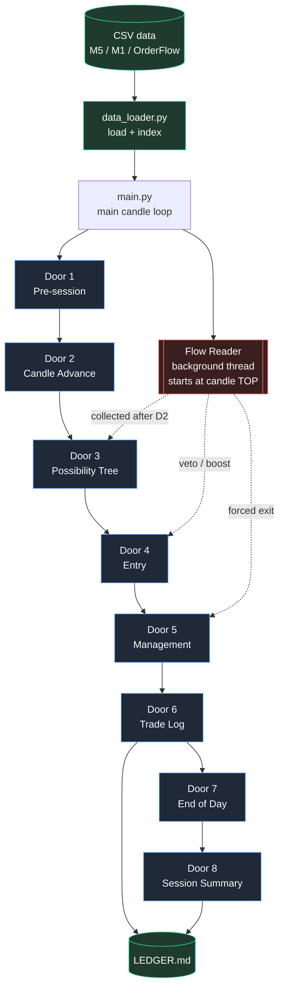
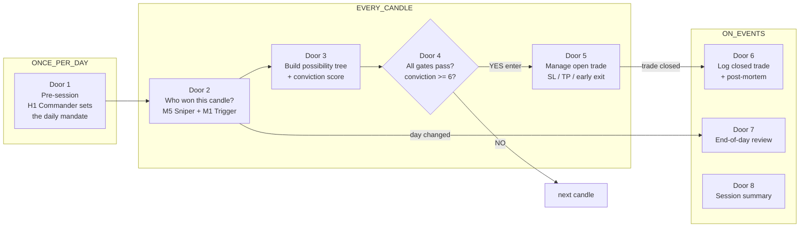
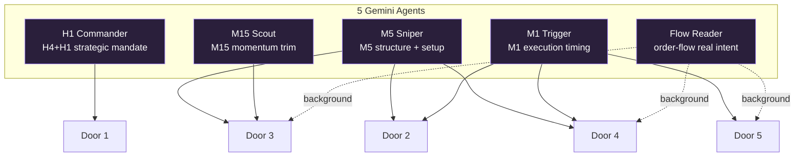
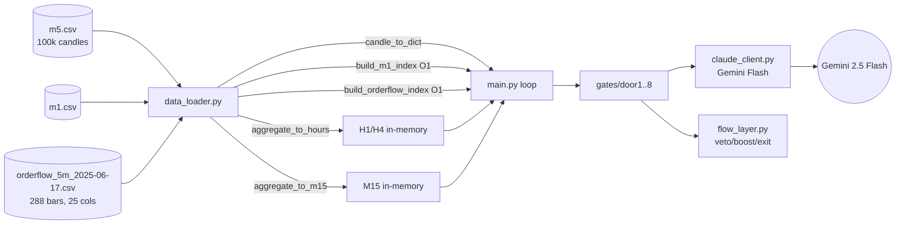
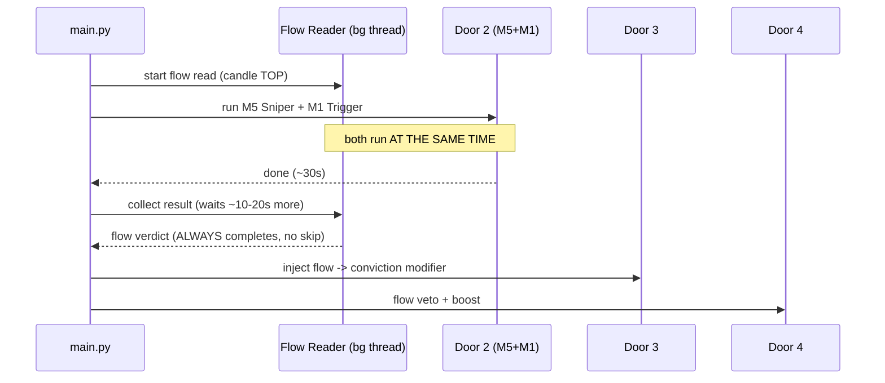
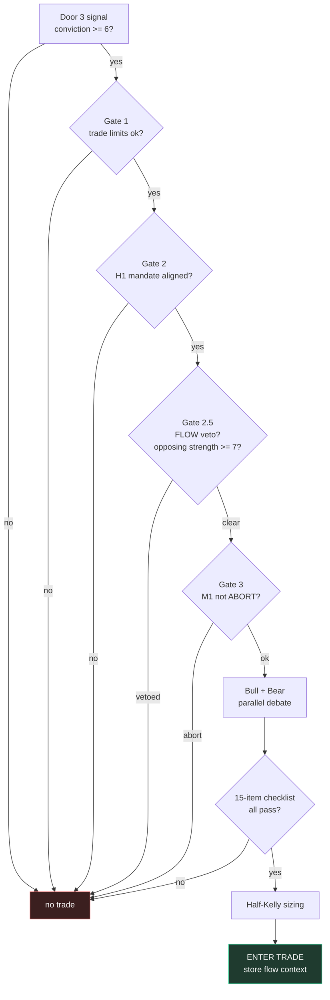
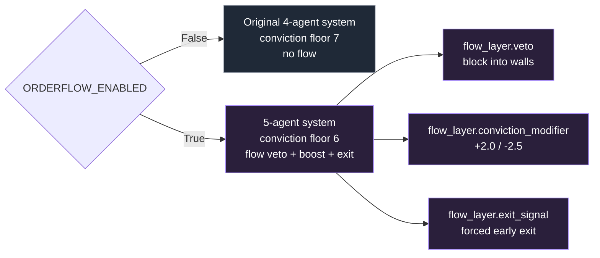

# 6YEARSOFPAIN — Visual Architecture

Open this file on GitHub (phone or desktop) — all diagrams render automatically.

> **The big idea:** one M5 candle enters the top, falls through 8 sequential "doors."
> Each door is a gate run by one or more Gemini agents. If a door blocks, the candle
> is dropped and we move to the next. If it passes all gates, a trade is entered,
> managed, and logged.

---

## 1. The whole system at a glance

---

## 2. The 8 doors — what each one decides

---

## 3. Which agent runs in which door

5 Gemini agents, each a different timeframe / role.

---

## 4. Data flow — file by file

---

## 5. The flow-threading trick (why it's fast now)

The Flow Reader is slow (~60-90s). Instead of blocking, it runs in a background
thread that **starts before Door 2** and is **collected after Door 2** — so it
overlaps with the required agents instead of adding on top.

---

## 6. Door 4 — the entry decision (the gauntlet)

---

## 7. Order flow layer (additive — behind one switch)

Everything order-flow lives behind `config.ORDERFLOW_ENABLED`.
**Off = byte-for-byte the original 4-agent behavior.**

---

## Quick reference

| Thing | Value |
|---|---|
| Brain | Gemini 2.5 Flash |
| Agents | 5 (H1, M15, M5, M1, Flow Reader) |
| Doors | 8 sequential gates |
| Conviction floor | 6 (flow on) / 7 (flow off) |
| Flow boost / penalty | +2.0 / -2.5 max |
| Flow veto strength | ≥7 opposing |
| Max trades | 30 total, 24/day |
| Kill switch | 5 consecutive losses → day halt |
| Min R:R | 1.5 |
| Data | 100k M5 candles, 288 order-flow bars (2025-06-17) |

See **DOORS.md** for a deep dive on every single door (all questions, all gates, per-door diagrams).
See **CLAUDE.md** for full file map and run instructions.
