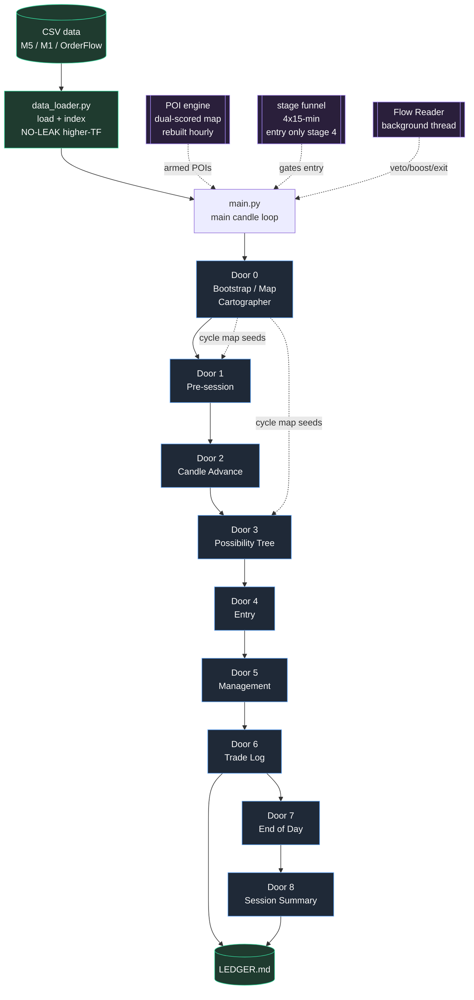
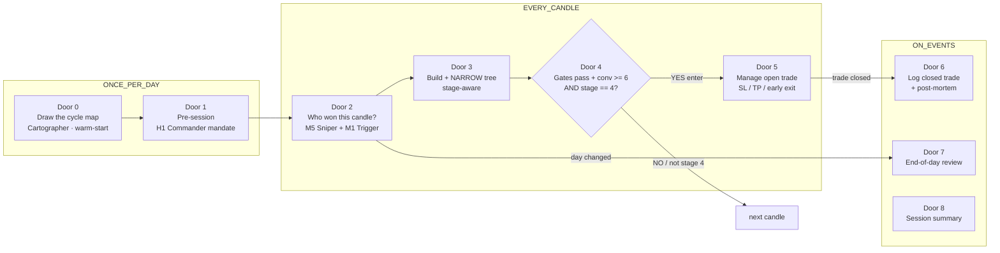
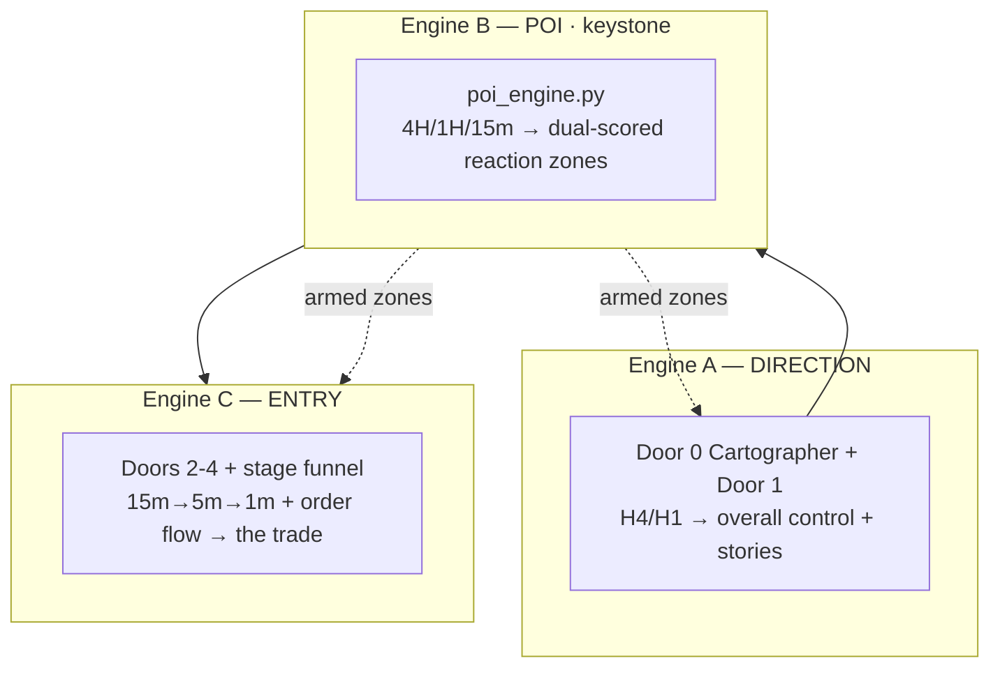
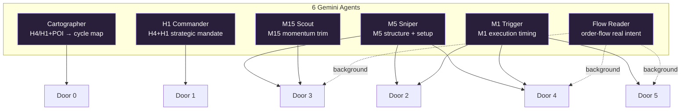
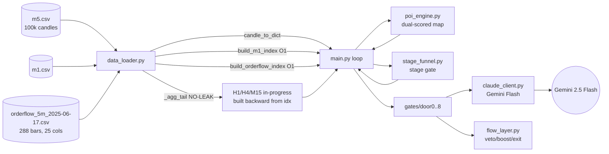
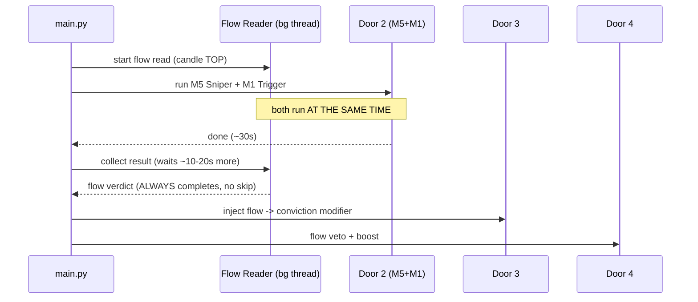
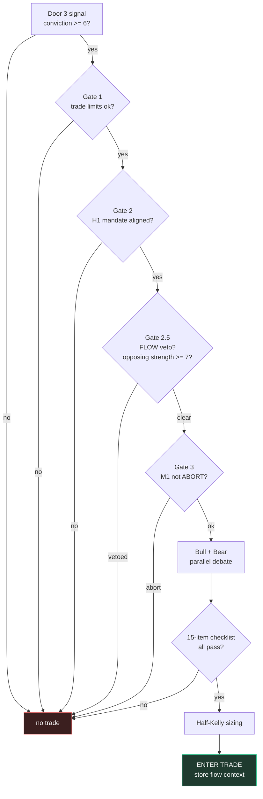
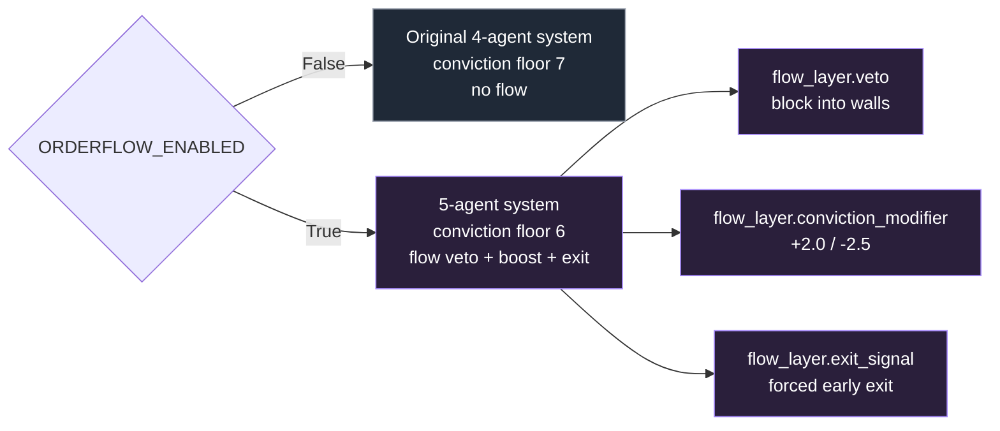

# 6YEARSOFPAIN — Visual Architecture

Open this file on GitHub (phone or desktop) — all diagrams render automatically.

> **The big idea:** one M5 candle enters the top, falls through sequential "doors."
> Each door is a gate run by one or more Gemini agents. If a door blocks, the candle
> is dropped. If it passes all gates, a trade is entered, managed, and logged.
> Two always-on layers wrap the doors: the **POI engine** (reaction-zone map) and the
> **stage funnel** (narrow the hour, only enter in stage 4).

**Updated 2026-06-03** — added **Door 0** (Cartographer / warm-start), the **POI engine**
(dual-scored reaction zones), the **stage funnel**, and fixed the **future-candle leak**.

---

## 1. The whole system at a glance

---

## 2. The doors — what each one decides

---

## 2b. The three analytical engines (the vision)

The system is really **three gather→narrow→story engines** + execution, not just an entry machine:

---

## 3. Which agent runs in which door

5 Gemini agents, each a different timeframe / role.

> Plus the Bull + Bear debate agents inside Door 4 (use the `default` system prompt).

---

## 4. Data flow — file by file

---

## 5. The flow-threading trick (why it's fast now)

The Flow Reader is slow (~60-90s). Instead of blocking, it runs in a background
thread that **starts before Door 2** and is **collected after Door 2** — so it
overlaps with the required agents instead of adding on top.

---

## 6. Door 4 — the entry decision (the gauntlet)

---

## 7. Order flow layer (additive — behind one switch)

Everything order-flow lives behind `config.ORDERFLOW_ENABLED`.
**Off = byte-for-byte the original 4-agent behavior.**

---

## Quick reference

| Thing | Value |
|---|---|
| Brain | Gemini 2.5 Flash |
| Agents | 6 (Cartographer, H1, M15, M5, M1, Flow Reader) + Bull/Bear in Door 4 |
| Doors | Door 0 + 8 gates |
| Engines | Direction (D0/D1), POI (keystone), Entry (D2-4 + funnel) |
| POI scores | structural 0-10 + crowd 0-10 → CLEAN/QUIET/FIGHT/IGNORE |
| Stage funnel | 4×15-min per hour, entry only in stage 4 |
| Conviction floor | 6 (flow on) / 7 (flow off) |
| Flow boost / penalty | +2.0 / -2.5 max · veto ≥7 opposing |
| Max trades | 30 total, 24/day · Kill switch 5 losses · Min R:R 1.5 |
| Look-ahead | NONE — higher-TF in-progress candle built only up to now |
| Data | 100k M5 candles, 288 order-flow bars (2025-06-17) |
| Switches | POI_ENABLED · STAGE_FUNNEL_ENABLED · ORDERFLOW_ENABLED (off = original) |

See **DOORS.md** for a deep dive on every single door (all questions, all gates, per-door diagrams).
See **CLAUDE.md** for full file map and run instructions.
