# 6YEARSOFPAIN — The Doors in Detail

Every door, what it does, which agent runs it, the **exact questions** asked, and
what passes vs blocks. Open on GitHub — all diagrams render.

> A candle falls through the doors top to bottom. **Door 0 + Door 1 run once per day.**
> Doors 2→5 run every candle. Doors 6→8 fire on events (trade close, day end, session end).
> Two always-on layers wrap the doors: the **POI engine** (reaction-zone map) and the
> **stage funnel** (narrow the hour, enter only in stage 4).

**Legend:** 🟢 pass / continue 🔴 block / drop candle 🧠 Gemini agent 🐍 Python-only logic

**Updated 2026-06-03** — added Door 0 (Cartographer), the POI engine, the stage funnel,
and fixed the future-candle leak. See the new sections at the end.

---

# 🚪 DOOR 0 — BOOTSTRAP / OVERALL MAP
**Runs:** once per day, BEFORE Door 1 · **Agent:** 🧠 Cartographer · **Reads:** H4 + H1 + POI map

### What it does
The warm-start gate (Idea 3) and the **Direction story engine** (Idea 2 gap). Before any
trading, it re-anchors the overall ideology and draws the **cycle map** the whole session
navigates by — so the session never starts blind. This is the gather→narrow→story process
applied to Direction, not just Entry.

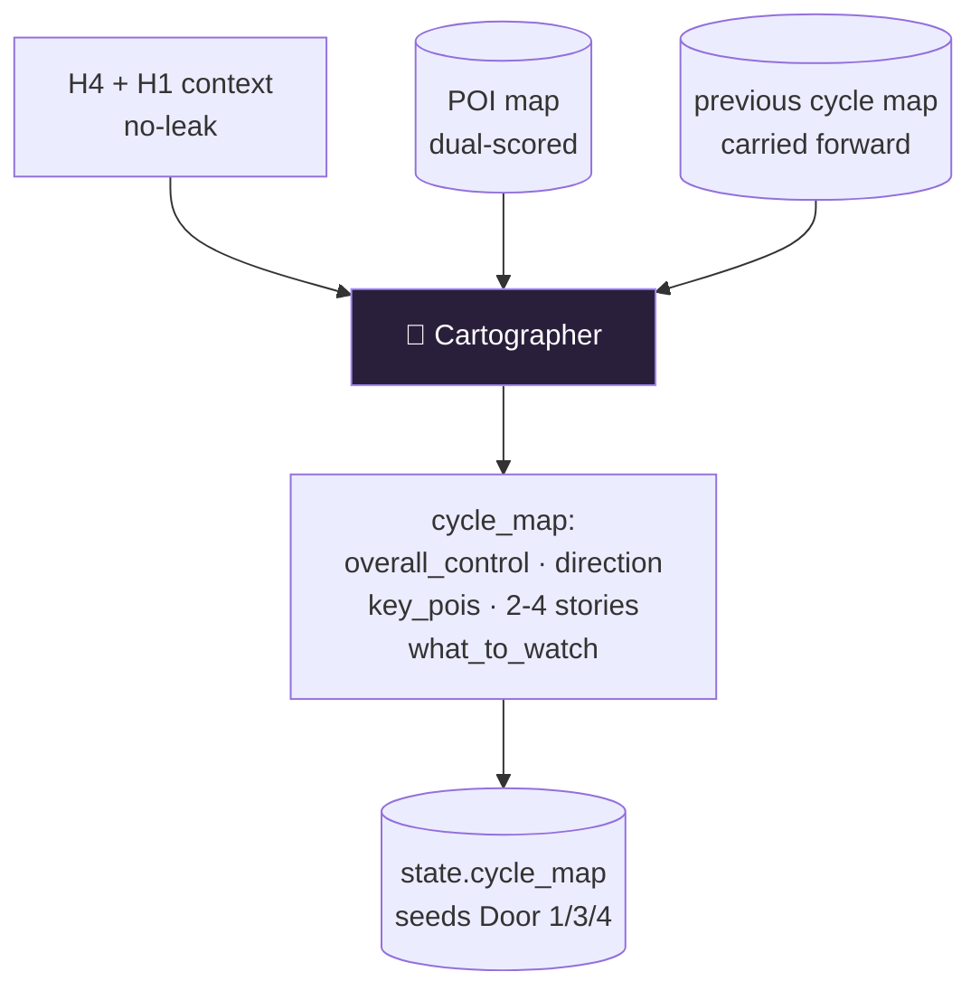

### Cartographer output (the cycle map)
| field | meaning |
|---|---|
| overall_control | who controls the macro battle + exact H4/H1 price evidence |
| direction | BULLISH / BEARISH / NEUTRAL |
| key_pois | the handful of POIs that matter THIS cycle + who defends them |
| stories[] | 2-4 possible cycle stories (the funnel seed), incl. one counter-intuitive, each with confirm + invalidate |
| what_to_watch | the single price that tips which story wins |

**Always passes** — it draws the map, never blocks. Stored in `state["cycle_map"]`,
carried forward, and its `summary()` seeds Door 1, Door 3, Door 4.

---

# 🚪 DOOR 1 — PRE-SESSION
**Runs:** once at the start of each day · **Agent:** 🧠 H1 Commander · **Reads:** H4 + H1 only

### What it does
Sets the **strategic mandate** for the whole day before any M5 candle is seen.
The H1 Commander decides the bias (BULLISH / BEARISH / NEUTRAL) and the exact price
that would flip it. This mandate becomes a **veto power** used later in Door 4.

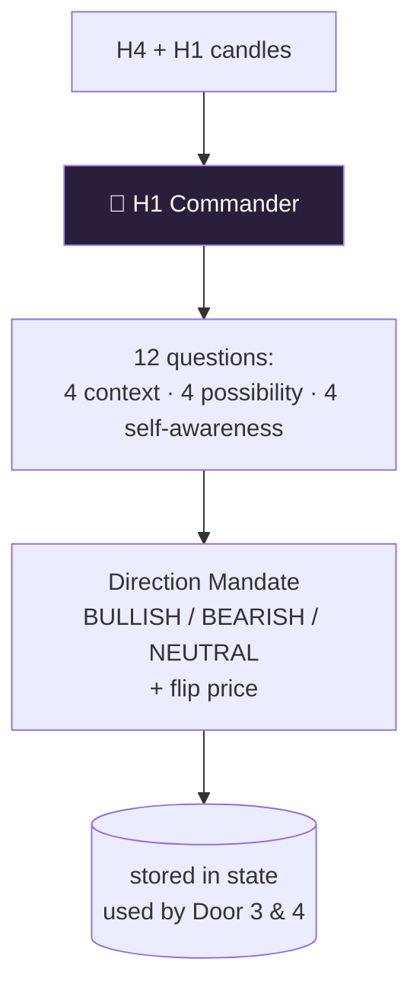

### The 12 questions
| # | Group | Question |
|---|---|---|
| q1 | Context | What did **buyers** do on H4/H1 yesterday? Which levels defended/attacked/lost? |
| q2 | Context | What did **sellers** do on H4/H1 yesterday? Final position? |
| q3 | Context | Who controls **right now** at H1? Evidence from bodies/wicks/closes. |
| q4 | Context | List 2-4 key battle levels — exact price, who won, what followed. |
| q5 | Possibility | 3 possible paths — full story with prices. |
| q6 | Possibility | For each path: confirm condition + invalidate price. |
| q7 | Possibility | Which path matches what buyers/sellers actually did recently? |
| q8 | Possibility | The path most people are **not** watching? |
| q9 | Self-aware | What bias do you have? Are you cherry-picking evidence? |
| q10 | Self-aware | What exact H1 close/H4 level would **change your view**? |
| q11 | **Self-aware** | **Direction mandate: BULLISH/BEARISH/NEUTRAL + flip price** ← the key output |
| q12 | Self-aware | What are you NOT seeing clearly in H4/H1? |

**Output used downstream:** `q11_direction_mandate` (→ Door 4 veto), `q10_mind_changer` (→ Door 3).
**Always passes** — it sets context, never blocks.

---

# 🚪 DOOR 2 — CANDLE ADVANCE
**Runs:** every candle · **Agents:** 🧠 M5 Sniper + 🧠 M1 Trigger (parallel) · 🧠 Flow Reader (background)

### What it does
Reads the new M5 candle: **who attacked, who won, was there absorption or a trap.**
M5 Sniper reads the candle body/wicks; M1 Trigger reads the minute-by-minute battle
inside it. The Flow Reader (started in the background *before* this door) reads the
real order flow. First runs hard **code checks** that the AI cannot override.

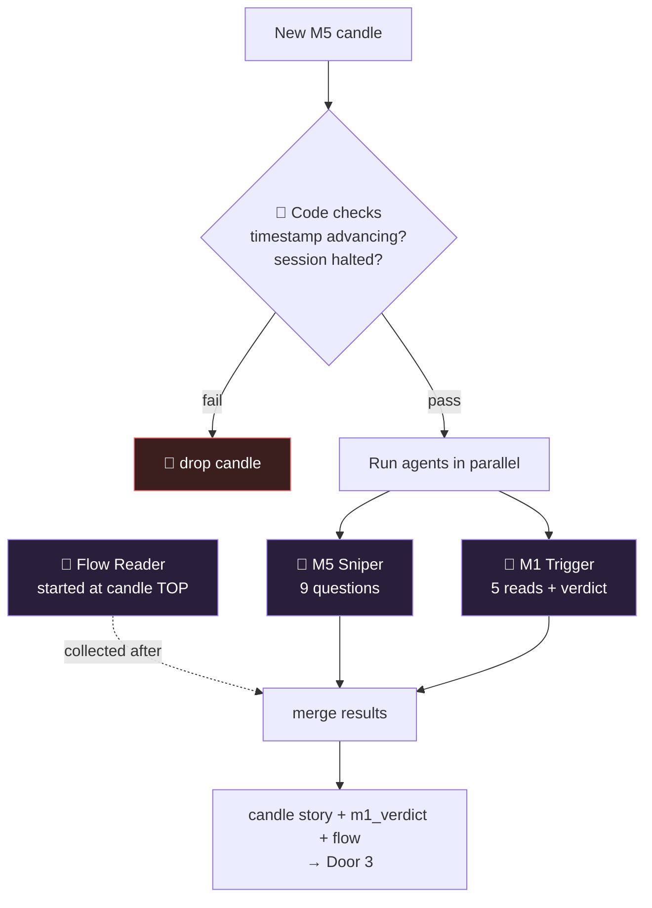

### M5 Sniper — 9 questions
| # | Question |
|---|---|
| q1 | Who **attacked** this M5 candle — buyers or sellers? Body evidence. |
| q2 | Who **won**? Where did price close vs high/low? |
| q3 | **Absorption** evidence? (wick into level, small body, close away from extreme) |
| q4 | **Trap**? Break of a level then reversal in same candle? |
| q5 | M5-level **intention** — what targets are they reaching for? |
| q6 | What are **buyers** doing at this close? Strong/weak/defending/retreating? |
| q7 | What are **sellers** doing at this close? |
| q8 | How does this candle **update the possibility tree**? |
| q9 | 3 next-candle **scenarios** (buyers press / sellers take / indecision). |

### M1 Trigger — 5 reads + verdict
| field | meaning |
|---|---|
| m1_first_mover | Who attacked first in the M1 sub-candles? Held or reversed? |
| m1_absorption | M1 absorption — who absorbed whom? |
| m1_trap | M1 trap — a failed break, exact candle + price. |
| m1_momentum | Is M1 momentum REAL (bodies growing) or FADING (shrinking)? |
| **m1_verdict** | **CLEAN / WAIT / ABORT** ← gates entry in Door 4 |

**Code checks block if:** timestamp not advancing, or session halted.
**Otherwise always passes** to Door 3 (it's analysis, not a gate).

---

# 🚪 DOOR 3 — POSSIBILITY TREE
**Runs:** every candle · **Agents:** 🧠 M5 Sniper (tree) + 🧠 M15 Scout (parallel) · 🐍 conviction math

### What it does
M5 Sniper builds a **possibility tree** (3-4 branches, always one counter-intuitive)
and proposes an entry signal with a raw conviction 0-10. M15 Scout reads M15 momentum.
Then **Python adjusts conviction** based on M15 alignment and order flow — no extra AI call.

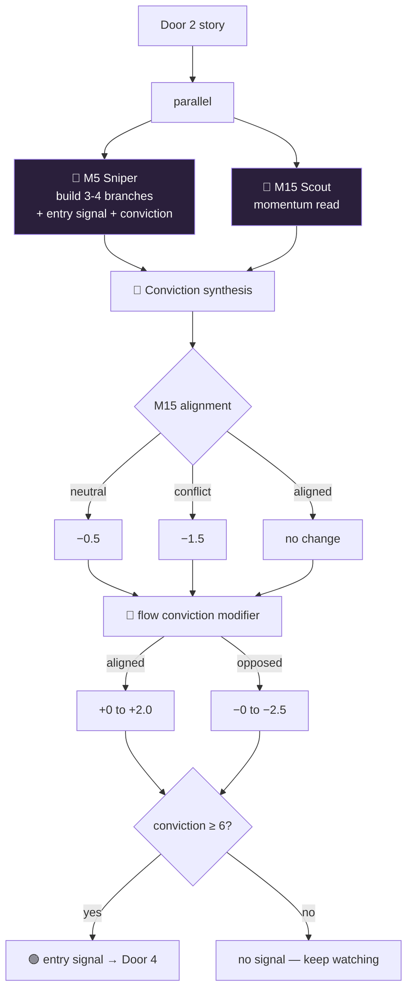

### M5 Sniper builds each branch with:
name · direction · buyer/seller story · **confirm** price · **invalidate** price · target.
Plus an `entry_signal`: exists? · direction · entry/SL/TP levels · POI · **conviction 0-10** · reasoning.

### M15 Scout — 7 reads
| field | meaning |
|---|---|
| m15_control | buyers / sellers / neutral |
| m15_energy | expanding / compressing / exhausting / waiting |
| m15_direction | bullish / bearish / sideways |
| m15_nearest_level | nearest M15 battle level + evidence |
| m15_confirms_h1 | does M15 agree with the H1 mandate? |
| m15_conflict | is M15 actively fighting the trade direction? |
| m15_note | one-sentence summary |

### 🐍 The conviction math (Python, deterministic)
```
M15 sideways      → conviction − 0.5
M15 conflicting   → conviction − 1.5
M15 aligned       → no change
Flow aligned      → + min(2.0, (strength−5)×0.5)
Flow opposing     → − min(2.5, (strength−5)×0.6)
if conviction < 6 → entry_signal.exists = False
```

---

# 🚪 DOOR 4 — TRADE ENTRY GATE (the gauntlet)
**Runs:** when a signal exists · **Agents:** 🧠 Bull + 🧠 Bear (parallel) + 🧠 M5 Sniper (checklist) · 🐍 5 gates

### What it does
The hardest door. A signal must survive **5 sequential gates** then a **16-item checklist**
and **10 thinking questions**, all reaching conviction ≥ 6, before a trade is sized and entered.

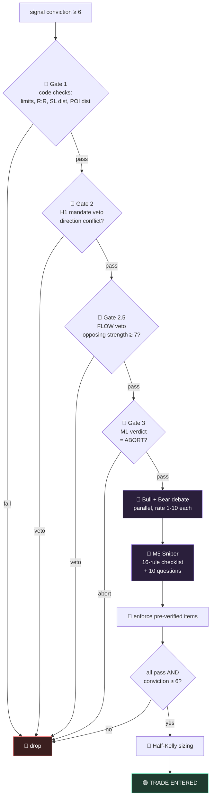

### The 5 gates (🐍 Python, AI cannot override)
| Gate | Blocks if… |
|---|---|
| 1 — Code checks | daily/total limit hit · already in trade · halted · SL too close · POI too far · R:R < 1.5 |
| 2 — H1 veto | LONG when mandate BEARISH, or SHORT when mandate BULLISH |
| 2.5 — Flow veto | opposing flow strength ≥ 7, or verdict = ABSORPTION_REVERSAL / EXHAUSTION |
| 3 — M1 gate | m1_verdict = ABORT (WAIT only warns) |
| 5 — Final | not all checklist pass, or final_conviction < 6 |

### Bull vs Bear (🧠 parallel debate)
- **Bull Agent:** strongest case buyers are in control → rating 1-10 + evidence + invalidation.
- **Bear Agent:** strongest case sellers are in control → rating 1-10 + evidence + invalidation.

### The 16-rule checklist
🤖 = AI-judged · 🔒 = pre-verified by Python (enforced after AI call, cannot be flipped)

| Rule | Type |
|---|---|
| three_checkpoints_hit | 🤖 |
| options_remaining_2_or_less | 🤖 |
| movie_test_clear | 🤖 |
| poi_not_midway | 🤖 |
| poi_distance_ok | 🤖 |
| rr_minimum_1_5 | 🤖 |
| trades_today_ok | 🔒 |
| total_trades_ok | 🔒 |
| not_fresh_untested_level | 🤖 |
| conviction_7_plus (now ≥6) | 🔒 |
| h1_h4_aligned | 🔒 (Gate 2 already enforced) |
| m1_trigger_not_abort | 🔒 (Gate 3 already enforced) |
| order_flow_confirms | 🔒 (Gate 2.5 already enforced) |
| not_news_blackout | 🔒 |
| first_candle_plan_defined | 🤖 |
| m15_not_opposing | 🤖 |

> **This was the bug.** `h1_h4_aligned` used to fail forever (no H1/H4 data) and blocked
> every trade. Fix: it's pre-verified in Python and **enforced after the AI call** so Gemini
> can't override it. Same pattern for the other 🔒 items.

### The 10 entry thinking questions
q1 dominant branch · q2 inversion point · q3 ≤2 branches left · q4 battle level ·
q5 SL liquidity · q6 TP liquidity · q7 trap possibility · q8 opposite side now ·
q9 level history · q10 minimum confirmation to enter.

### 🐍 Half-Kelly sizing (on entry)
```
f* = 0.5 × (b×p − q) / b      b=R:R, p=win rate, q=1−p
clamped to [MIN_POSITION_SIZE, MAX_POSITION_SIZE]
```

---

# 🚪 DOOR 5 — TRADE MANAGEMENT
**Runs:** every candle while a trade is open · **Agents:** 🧠 Re-eval + 🧠 M1 Trigger + 🧠 Flow Reader (parallel)

### What it does
Manages the open trade. **Hard rules first** (no AI): first-candle fast-exit, SL/TP hit.
Then three agents decide whether the **story has changed** enough to exit early.

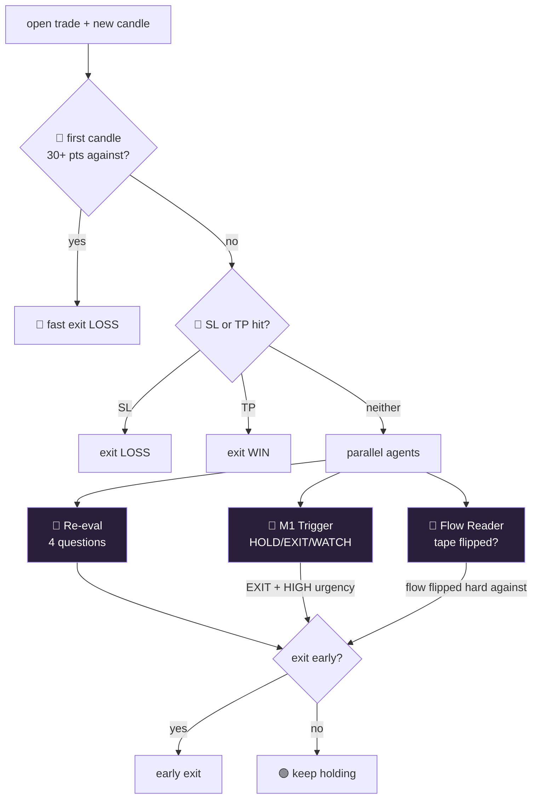

### Re-eval — 4 questions
| # | Question |
|---|---|
| q1 | Is the original **branch still valid**? Entry conditions still in place? |
| q2 | Are buyers/sellers doing **exactly what was expected**? |
| q3 | Is the **inversion point intact** (price hasn't crossed it)? |
| q4 | Has a **new branch overtaken** the original — different story now? |

→ `exit_early` only if the **story changed**, not just because price is against you.

### Forced-exit overrides
- **M1 Trigger:** verdict EXIT + urgency HIGH → force exit.
- **Flow Reader:** tape flipped hard against the position (same logic as the entry veto) → force exit.

**Hard rules always win:** first-candle fast-exit and SL/TP fire before any AI runs.

---

# 🚪 DOOR 6 — TRADE LOG
**Runs:** when a trade closes · **Agent:** 🧠 default (post-mortem)

### What it does
Writes a **post-mortem** of the closed trade and appends a row + narrative to `LEDGER.md`
(including the order-flow context that was present at entry).

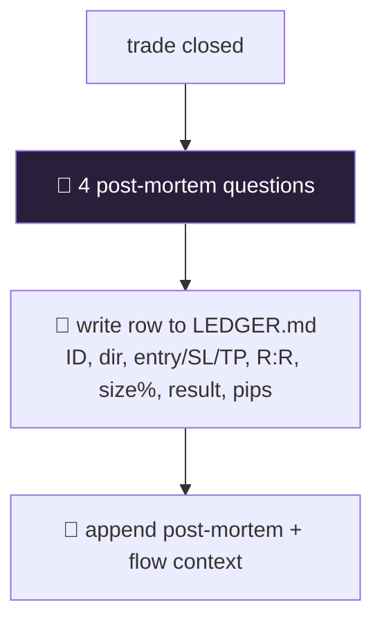

### 4 post-mortem questions
| # | Question |
|---|---|
| q1 | What was the **branch**? Who proved it right/wrong, at which exact level? |
| q2 | **Why did it win or lose** — full buyer/seller narrative? |
| q3 | Did the **inversion point** get hit before close? |
| q4 | What would you do **differently** — one specific change? |

**Logged to LEDGER:** entry/SL/TP, R:R, size %, result, pips, max favorable/against, **flow verdict/bias/strength at entry**.

---

# 🚪 DOOR 7 — END OF DAY
**Runs:** on day boundary · **Agent:** 🧠 default · **Includes:** 🐍 kill switch

### What it does
Checks the **kill switch** (5 consecutive losses → halt the day) and writes a 5-question
day reflection.

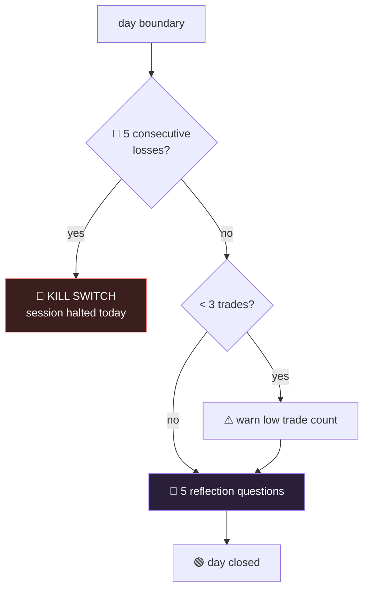

### 5 reflection questions
q1 dominant dynamic today · q2 who controlled the session + turning point ·
q3 key battles (who fought, who won, what followed) · q4 what you learned ·
q5 what to do differently tomorrow.

> Kill switch **resets next day** (main.py auto-clears the halt on a new day).

---

# 🚪 DOOR 8 — SESSION END
**Runs:** once at the very end · **Agent:** 🧠 default

### What it does
Prints the **final session report** (trades, win rate, total pips) and writes 4
session-level reflections to `LEDGER.md`.

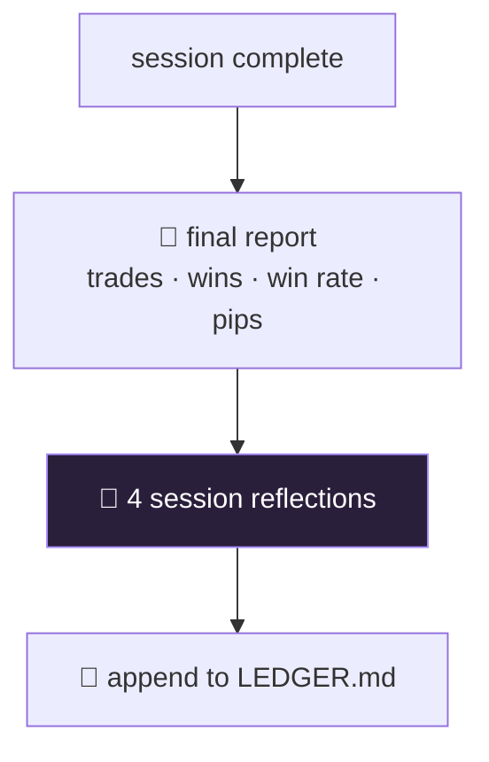

### 4 session questions
q1 patterns repeated across the session · q2 which branch types were most reliable ·
q3 where the thinking process failed · q4 what changes next session.

---

# 🧠 Bonus: The Flow Reader's 8 questions
The 5th agent. Runs in the background, feeds Doors 3/4/5. Reads **real order flow** (delta,
volume, whale prints, POC) — not candle shape.

| # | Question |
|---|---|
| q1 | Who is **hitting the tape** now — buyers or sellers? Quote delta + delta%. |
| q2 | Does delta **confirm or diverge** from the candle close? (divergence = TRAP) |
| q3 | Was aggressive volume **absorbed** (heavy delta, little price move)? Who wins next? |
| q4 | **Whale / large-trade** activity? Which side — accumulating or distributing? |
| q5 | Where did volume concentrate (**POC**)? Buy-heavy or sell-heavy? Accepting/rejecting? |
| q6 | What is **cumulative delta** doing? Underlying campaign bullish or bearish? |
| q7 | Is aggression **fading** (exhaustion / reversal warning)? |
| — | **flow_verdict:** BUY_FLOW / SELL_FLOW / ABSORPTION_REVERSAL / EXHAUSTION / NEUTRAL |
| — | **flow_bias:** bullish / bearish / neutral · **flow_strength:** 1-10 |

### How its output is used
| Door | Use |
|---|---|
| Door 3 | conviction modifier: aligned +0→+2.0, opposed −0→−2.5 |
| Door 4 | **veto** (Gate 2.5) if opposing strength ≥ 7 + `order_flow_confirms` checklist item |
| Door 5 | **forced early exit** if tape flips hard against the open trade |
| Door 6 | logged at entry (verdict/bias/strength) |

---

# 🗺️ Layer: THE POI ENGINE (keystone — `poi_engine.py`)
Not a door — an always-on layer that feeds Door 0/1/3/4. A **persistent, dual-scored map**
of reaction zones across 4H/1H/15m. Pure Python, no look-ahead, the AI cannot fake the scores.

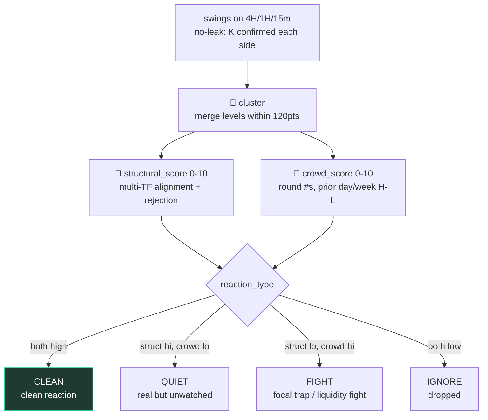

| field | meaning |
|---|---|
| price · side | level; side flips LIVE vs price (broken resistance → support) |
| structural_score 0-10 | how many timeframes see it + how hard price was rejected |
| crowd_score 0-10 | focal/attention — round numbers, prior day/week highs-lows (deterministic) |
| reaction_type | **CLEAN** clean bounce · **QUIET** soft/late · **FIGHT** liquidity grab · IGNORE |
| timeframes · tested_count · armed · distance_pts | which TFs · times price visited · near-price flag · live distance |

**Lifecycle:** rebuilt each clock hour → `arm()` every candle (flags POIs within 160pts) →
`mark_tested()` when a candle wicks through. Armed POIs are injected into Door 1/3/4 prompts;
the full top-N map feeds Door 0.

**Why two scores (Idea 6):** when structural & crowd **align** → highest conviction, clean
reaction. When they **conflict** → that conflict *is* the signal: a focal-but-weak level is
where the crowd's stops get hunted (FIGHT), not where price bounces tidily.

---

# ⏳ Layer: THE STAGE FUNNEL (`stage_funnel.py`)
Each clock hour = **4 × 15-min stages**. The story space narrows stage by stage and a
**new trade is only opened in stage 4.** Trade *management* runs every candle regardless.

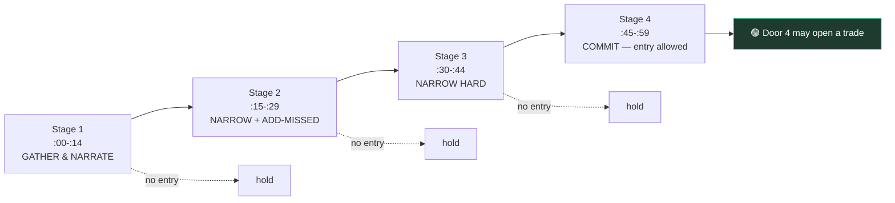

- **Stage guidance** is appended to Door 3's prompt so the M5 Sniper acts per stage:
  gather (1) → narrow + add 2-3 missed (2) → cut hard (3) → commit to the dominant story (4).
- **Door 4 entry** is gated by `entry_allowed(stage)` — signals found in stages 1-3 are **held**,
  not taken. The tree is carried forward and narrowed across the hour.

---

# 🔒 Fix: NO FUTURE-CANDLE LEAK (`data_loader._agg_tail`)
Higher-TF context (H1/H4/M15) is built **backward from the current M5 index**. Closed
buckets are fully formed; the **most recent bucket is the in-progress candle**, built only
from M5 up to *now* (its close == current M5 close), exactly like a live chart. No future
sub-candle ever leaks into the current higher-TF read.

---

See **ARCHITECTURE.md** for the system-wide diagrams and **CLAUDE.md** for the file map.
